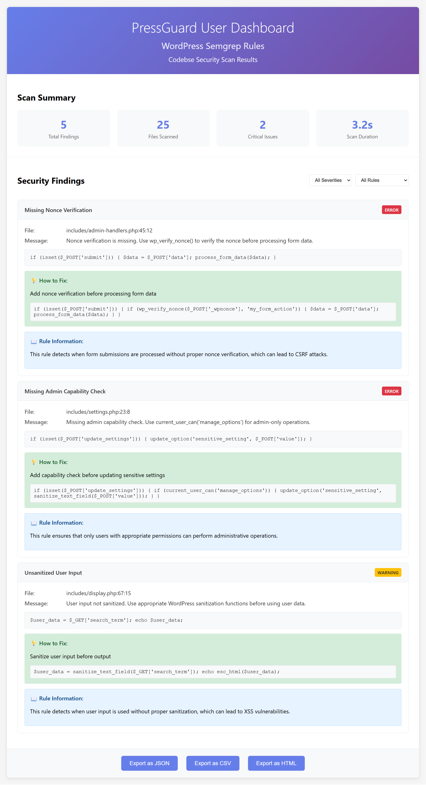
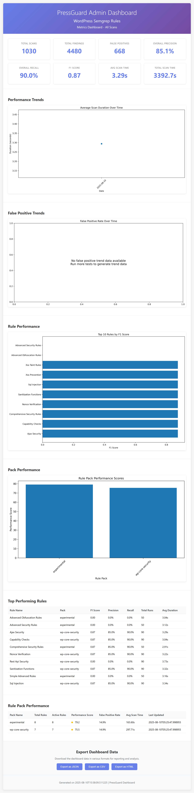

# PressGuard - WordPress Security Scanner

[](https://github.com/giga-b/wordpress-semgrep-rules/actions)
[](https://opensource.org/licenses/MIT)
[](https://semgrep.dev/)

**PressGuard** is a comprehensive WordPress security scanning solution that combines the power of Semgrep static analysis with advanced dashboard analytics. Designed specifically for WordPress plugin and theme developers, it provides automated security scanning, detailed vulnerability reporting, and interactive dashboards for monitoring security posture.

## 🛡️ Key Features

- **Comprehensive Security Rules**: 15+ specialized WordPress security rules covering nonce verification, capability checks, SQL injection, XSS prevention, and more
- **Interactive Dashboards**: Real-time security scan results with detailed findings, fix suggestions, and performance metrics
- **Auto-Fix Capabilities**: Intelligent code suggestions with multi-layer validation for common security issues
- **Performance Optimization**: Configurable scan profiles optimized for different development stages
- **IDE Integration**: VS Code and Cursor extensions for real-time security feedback
- **CI/CD Ready**: GitHub Actions integration for automated security scanning
- **Advanced Analytics**: Detailed metrics on scan performance, false positive rates, and rule effectiveness

## 🎯 Target Users

- **WordPress Plugin Developers**: Ensure your plugins follow WordPress security best practices
- **Theme Developers**: Build secure themes with automated security validation
- **Security Auditors**: Comprehensive security analysis tools for WordPress codebases
- **Development Teams**: Integrate security scanning into your development workflow

## 📊 Dashboard Overview

PressGuard provides powerful dashboards for monitoring security scan results and performance metrics:

### User Dashboard

*Real dashboard screenshot showing interactive security scan results with detailed findings, fix suggestions, and export capabilities*

### Admin Dashboard  

*Real dashboard screenshot showing comprehensive metrics dashboard with scan performance, rule effectiveness, and trend analysis*

## Quick Start

> **Note**: This project is now live on GitHub! Check out the [repository](https://github.com/giga-b/wordpress-semgrep-rules) for the latest updates.

> **⚠️ Security Notice**: Before using the auto-fix system, please review our [Security Considerations](docs/SECURITY-CONSIDERATIONS.md) guide.

> **🔄 CI/CD Status**: GitHub Actions workflows are configured for automated security scanning. The workflow uses the latest `actions/upload-artifact@v4` to avoid deprecation warnings.

## 🔌 VS Code Extension

**Get real-time WordPress security scanning directly in VS Code!**


PressGuard includes a comprehensive VS Code extension that provides:
- **Real-time Security Scanning**: Scan your WordPress code as you type
- **Inline Diagnostics**: See security issues highlighted directly in your code
- **Quick Fixes**: Apply suggested fixes with a single click
- **Custom Rules**: Use WordPress-specific security rules
- **Performance Metrics**: Track scan performance and rule effectiveness

### 📦 Installation

#### Option 1: Install from VSIX (Recommended)
1. Download the extension: [`wordpress-semgrep-security-1.0.0.vsix`](vscode-extension/wordpress-semgrep-security-1.0.0.vsix)
2. In VS Code, go to **Extensions** (Ctrl+Shift+X)
3. Click the **...** menu and select **Install from VSIX...**
4. Select the downloaded `.vsix` file
5. Restart VS Code

#### Option 2: Build from Source
```bash
cd vscode-extension
npm install
npm run compile
# Then install the generated .vsix file
```

### 🚀 Quick Start with VS Code Extension
1. Install the extension using one of the methods above
2. Open a WordPress plugin or theme project
3. The extension will automatically detect WordPress files
4. Security issues will be highlighted in real-time
5. Use Ctrl+Shift+P and search "WordPress Semgrep" for commands

### 📋 Extension Features
- **Automatic Semgrep Detection**: Installs Semgrep if not present
- **WordPress Rule Sets**: Pre-configured WordPress security rules
- **Custom Configurations**: Support for custom rule configurations
- **Performance Optimization**: Fast scanning with minimal overhead
- **Integration**: Works seamlessly with existing VS Code workflows

For detailed extension documentation, see [vscode-extension/README.md](vscode-extension/README.md).

## 🚀 Cursor Extension

**Enhanced WordPress security scanning with AI-powered quick fixes for Cursor IDE!**


PressGuard includes an advanced Cursor extension that provides all VS Code features plus AI-enhanced capabilities specifically designed for Cursor's intelligent development environment.

### 🎯 Why Choose the Cursor Extension?

The Cursor extension is an **enhanced version** of the VS Code extension with additional features specifically designed for Cursor's AI-powered development environment:

#### **🚀 Advanced Features (Beyond VS Code)**
- **🔧 Quick Fixes**: One-click automatic security fixes with intelligent suggestions
- **🎨 Enhanced UI**: Better visual design with emoji-enhanced commands and improved UX
- **📝 Inline Diagnostics**: Security issues displayed directly in the editor for immediate feedback
- **🤖 AI Integration**: Optimized to work seamlessly with Cursor's AI capabilities
- **⚡ Context-aware Suggestions**: Intelligent fix recommendations based on issue type and code context

#### **🛡️ WordPress Security Excellence**
- **Real-time Security Scanning**: Scan your WordPress code as you type
- **Comprehensive Rule Coverage**: 15+ specialized WordPress security rules
- **Automatic Semgrep Detection**: Installs Semgrep if not present
- **Performance Optimization**: Fast scanning with minimal overhead

### 📦 Installation

#### Option 1: Build from Source (Recommended for Cursor)
```bash
# Clone the repository
git clone https://github.com/giga-b/wordpress-semgrep-rules.git
cd wordpress-semgrep-rules

# Navigate to Cursor extension
cd cursor-extension

# Install dependencies
npm install

# Build the extension
npm run compile

# Install in Cursor IDE
# (Follow Cursor's extension installation process)
```

#### Option 2: Development Mode
```bash
# For development and testing
cd cursor-extension
npm install
npm run watch  # For continuous compilation
```

### 🚀 Quick Start with Cursor Extension

1. **Install the extension** using the build process above
2. **Open a WordPress plugin or theme project** in Cursor
3. **Automatic detection**: The extension will detect WordPress files and Semgrep installation
4. **Real-time scanning**: Security issues will be highlighted as you code
5. **Use enhanced commands**: Access commands via `Ctrl+Shift+P` and search "WordPress Security"

### 📋 Enhanced Command Palette

| Command | Shortcut | Description |
|---------|----------|-------------|
| 🔒 Scan Current File | `Ctrl+Shift+S` | Scan the currently open PHP file |
| 🔒 Scan Workspace | - | Scan all PHP files in the workspace |
| 🔍 Show Security Problems | - | Open the security problems panel |
| 🔧 Apply Quick Fix | `Ctrl+Shift+F` | Apply quick fix at cursor position |
| ⚙️ Configure Security Rules | - | Open configuration dialog |
| 📦 Install/Update Semgrep | - | Install or update Semgrep automatically |

### 🎨 Advanced Configuration

The Cursor extension offers more granular configuration options:

```json
{
  "wordpressSemgrepCursor.enabled": true,
  "wordpressSemgrepCursor.autoScan": true,
  "wordpressSemgrepCursor.showInline": true,
  "wordpressSemgrepCursor.quickFixEnabled": true,
  "wordpressSemgrepCursor.configPath": "",
  "wordpressSemgrepCursor.rulesPath": "",
  "wordpressSemgrepCursor.severity": "WARNING",
  "wordpressSemgrepCursor.maxProblems": 100,
  "wordpressSemgrepCursor.timeout": 30000
}
```

#### **Advanced Settings Explained**
- **`showInline`**: Display security issues inline in the editor for immediate feedback
- **`quickFixEnabled`**: Enable automatic quick fixes with one-click application
- **`timeout`**: More granular timeout control (milliseconds vs seconds)
- **`severity`**: Enhanced severity levels with better categorization

### 🔧 Quick Fix Capabilities

The Cursor extension provides intelligent automatic fixes for common WordPress security issues:

#### **🔐 Authentication & Authorization**
- **Missing Nonce Verification**: Automatically add `wp_verify_nonce()` checks
- **Insufficient Capability Checks**: Add proper `current_user_can()` validation
- **Improper User Role Validation**: Implement correct role checking

#### **🛡️ Input Validation & Sanitization**
- **Unsanitized User Input**: Apply appropriate WordPress sanitization functions
- **Missing Input Validation**: Add proper validation logic
- **Improper Data Sanitization**: Replace unsafe sanitization with secure alternatives

#### **💉 SQL Injection Prevention**
- **Direct SQL Queries**: Convert to prepared statements
- **Missing Prepared Statements**: Add `$wpdb->prepare()` calls
- **Unsafe Database Operations**: Implement secure database patterns

#### **🌐 Cross-Site Scripting (XSS)**
- **Unescaped Output**: Add proper escaping functions
- **Missing Output Sanitization**: Apply `esc_html()`, `esc_attr()`, etc.
- **Improper Output Handling**: Implement secure output patterns

### 🎯 Enhanced User Experience

#### **Visual Improvements**
- **Emoji-enhanced Commands**: Easy-to-identify command names with icons
- **Better Status Dashboard**: Real-time status with enhanced visual feedback
- **Improved Problem Panel**: Hierarchical display with better organization
- **Inline Diagnostics**: Security issues shown directly in code for immediate awareness

#### **AI Integration Benefits**
- **Context-aware Suggestions**: Fixes tailored to your specific code context
- **Intelligent Recommendations**: AI-powered suggestions for best practices
- **Seamless Workflow**: Integration with Cursor's AI features for enhanced productivity

### 🔄 Migration from VS Code Extension

If you're already using the VS Code extension and want to upgrade to the Cursor version:

1. **Install the Cursor extension** using the build process above
2. **Transfer your settings** from VS Code to Cursor configuration
3. **Enable advanced features** like inline diagnostics and quick fixes
4. **Enjoy enhanced functionality** with AI-powered suggestions

### 📚 Documentation

For detailed Cursor extension documentation, see [cursor-extension/README.md](cursor-extension/README.md).

## 🚀 Dashboard Access

PressGuard includes interactive dashboards for monitoring security scans:

### User Dashboard
Access the user dashboard to view detailed security scan results:
```bash
# Start the dashboard server
python serve-dashboard.py

# Open in browser
http://localhost:8000/dashboard/user-dashboard.html
```

### Admin Dashboard
Access the admin dashboard for comprehensive metrics and analytics:
```bash
# Start the dashboard server
python serve-dashboard.py

# Open in browser  
http://localhost:8000/dashboard/index.html
```

### 📸 Capturing Dashboard Screenshots
To capture screenshots for documentation:
```bash
# Install dependencies
pip install selenium

# Capture screenshots
python dashboard/capture-screenshots.py
```

1. **Install Semgrep:**
   ```bash
   pip install semgrep
   ```

2. **Run security scan:**
   ```bash
   semgrep scan --config=configs/plugin-development.yaml tests/vulnerable-examples/
   ```

3. **Generate custom rules:**
   ```bash
   python tooling/generate_rules.py --categories wordpress-core,php-security --output custom-rules.yaml
   ```

4. **Use auto-fix system (with caution):**
   ```bash
   python tooling/auto_fix.py --results semgrep-results.json --dry-run
   ```

## Project Structure

```
wordpress-semgrep-rules/
├── dashboard/                    # Interactive dashboards
│   ├── user-dashboard.html      # Security scan results interface
│   ├── index.html              # Admin metrics dashboard
│   ├── favicon.svg             # Dashboard favicon
│   └── capture-screenshots.py  # Dashboard screenshot automation
├── packs/                       # Security rule packs
│   ├── wp-core-security/       # Core WordPress security rules
│   ├── wp-core-quality/        # WordPress code quality rules
│   └── experimental/           # Experimental and advanced rules
├── configs/                     # Scan configurations
│   ├── basic.yaml              # Essential security rules
│   ├── strict.yaml             # Comprehensive security rules
│   ├── plugin-development.yaml # Plugin development focus
│   ├── optimized-15s.yaml      # Performance optimized (15s)
│   └── optimized-30s.yaml      # Performance optimized (30s)
├── tests/                       # Test suites
│   ├── vulnerable-examples/    # Test cases that should trigger rules
│   ├── safe-examples/          # Test cases that should NOT trigger rules
│   ├── run-automated-tests.py  # Automated test runner
│   └── test-results/           # Test execution results
├── tooling/                     # Development tools
│   ├── generate_rules.py       # Rule generation script
│   ├── auto_fix.py             # Auto-fix system
│   ├── run-semgrep.ps1         # Windows runner
│   ├── run-semgrep.sh          # Unix runner
│   └── metrics_dashboard.py    # Metrics dashboard generator
├── results/                     # Scan and test results
│   ├── performance/            # Performance test results
│   └── test-results/           # Test execution results
├── docs/                        # Documentation
│   ├── development/            # Development documentation
│   ├── API-REFERENCE.md        # API documentation
│   ├── SECURITY-CONSIDERATIONS.md # Security guidelines
│   └── PRODUCTION-DEPLOYMENT-GUIDE.md # Deployment guide
├── cursor-extension/           # Cursor IDE extension
├── vscode-extension/           # VS Code extension
└── .github/                    # GitHub Actions workflows
```

## Configuration Types

- **basic.yaml**: Essential WordPress security rules
- **strict.yaml**: Comprehensive security rules for production
- **plugin-development.yaml**: Plugin-specific security patterns

## Rule Categories

### WordPress Core Security
- Nonce verification patterns
- Capability checks
- Sanitization function usage
- WordPress hook security

### Plugin Security
- Admin interface security
- AJAX endpoint security
- Plugin activation/deactivation
- Settings page security

### PHP Security
- SQL injection prevention
- XSS protection
- File operation security
- Deserialization safety

## Security

### Security Considerations
This project includes automated security scanning and fixing capabilities. Please review our comprehensive [Security Considerations](docs/SECURITY-CONSIDERATIONS.md) guide before using these features.

### Key Security Features
- **Enhanced Auto-fix Validation**: Multi-layer validation system for generated fixes
- **Path Validation**: Comprehensive path sanitization and validation
- **Configuration Hardening**: Secure default settings and validation
- **Error Handling**: Robust error handling with rollback capabilities
- **Backup System**: Automatic backup creation before any changes

### Security Best Practices
- Always test auto-fixes in development environment first
- Use preview mode to review proposed changes
- Enable backup creation before applying fixes
- Monitor logs for security events
- Regular security audits and updates

## Testing

Run tests against vulnerable examples:
```bash
semgrep scan --config=configs/plugin-development.yaml tests/vulnerable-examples/
```

Run tests against safe examples:
```bash
semgrep scan --config=configs/plugin-development.yaml tests/safe-examples/
```

## Contributing

We welcome contributions! Please see our [Contributing Guide](CONTRIBUTING.md) for details.

1. Fork the repository
2. Create a feature branch
3. Add new rules to the appropriate category in `packs/`
4. Create test cases in `tests/vulnerable-examples/`
5. Update configuration files as needed
6. Test thoroughly before committing
7. Submit a pull request

## Issues and Feature Requests

- [Bug Reports](https://github.com/giga-b/wordpress-semgrep-rules/issues/new?template=bug_report.md)
- [Feature Requests](https://github.com/giga-b/wordpress-semgrep-rules/issues/new?template=feature_request.md)

## Integration

### Pre-commit Hooks
Automatically scan staged files before commits.

### CI/CD Pipeline
Integrated security scanning in GitHub Actions.

### IDE Integration
Configure your IDE to use these rules for real-time scanning.

## Documentation

### Production Documentation
- [Production Deployment Guide](docs/PRODUCTION-DEPLOYMENT-GUIDE.md) - Complete deployment instructions for production environments
- [Production User Guide](docs/PRODUCTION-USER-GUIDE.md) - User guide for production workflows and integrations
- [API Reference](docs/API-REFERENCE.md) - Complete API documentation for all tools and interfaces

### Technical Documentation
- [WordPress Security Best Practices](https://developer.wordpress.org/plugins/security/)
- [Semgrep Documentation](https://semgrep.dev/docs/)
- [OWASP Top Ten](https://owasp.org/www-project-top-ten/)

## Repository Organization

This repository has been organized for better maintainability:

### 📁 Organized Structure
- **`results/`**: Contains all scan and test results
  - `performance/`: Performance test results and benchmarks
  - `test-results/`: Test execution results and reports
- **`docs/development/`**: Development documentation and summaries
- **`.gitignore`**: Updated to exclude development files and temporary results

### 🧹 Cleaned Up Files
- Removed development tracking files and internal documentation
- Moved performance and test results to organized folders
- Fixed bogus dates in documentation files
- Updated GitHub Actions to use latest artifact upload version

### 📸 Dashboard Images
- Real dashboard screenshots showing actual scan results and metrics
- Screenshots can be updated using the provided automation script
- Images show live data from actual security scans

## Support

## License

This project is licensed under the MIT License - see the [LICENSE](LICENSE) file for details.
