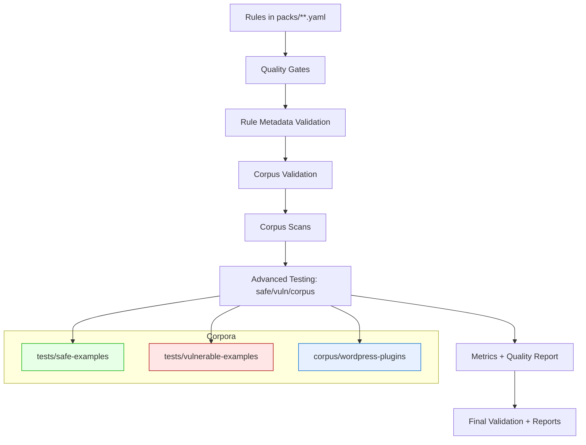

# Corpus-Based Testing Architecture

## Goals

- Validate Semgrep rules using a real-world WordPress corpus without embedded tests.
- Produce quality metrics (precision, recall, FPR/FNR, F1) and performance metrics (time, memory).
- Detect false positives via safe corpora and heuristics; surface candidates for review.
- Fit into existing scripts, result folders, and CI pipeline.

## Scope and Inputs

- Input rule packs: `packs/wp-core-security`, `packs/wp-core-quality`, `packs/experimental`.
- WordPress corpus: `corpus/wordpress-plugins/**` with metadata in `metadata.json`.
- Reference corpora: `tests/safe-examples/**`, `tests/vulnerable-examples/**`.
- Quality targets and thresholds: `.rule-quality.yml`.

## Components

1) Corpus Inventory and Validation
- Source of truth: `corpus/wordpress-plugins/metadata.json`.
- Script: `tests/validate-corpus.py` validates structure, counts, sizes, and spot Semgrep sanity.
- Output: `results/corpus-validation/*.json`.

2) Corpus Scanning Orchestrator
- Script: `tests/run-corpus-scans.py` (rule-by-rule scans across the corpus, parallelizable).
- Runtime controls: includes/excludes for heavy rules, byte/time limits, path filters.
- Output: `results/corpus-scans/{timestamp}.json` with per-rule findings and timings.

3) Advanced Testing Aggregator
- Script: `tests/advanced-testing-framework.py` runs each rule against:
  - vulnerable examples (proxy for true positives),
  - safe examples (proxy for false positives),
  - full corpus (for breadth, counts, and performance),
  and derives metrics. Stores detailed per-rule artifacts and a summary quality report in
  `results/advanced-testing/`.

4) False Positive Detection
- Heuristic pass: any findings on `tests/safe-examples/**` counted as FP candidates.
- Optional allowlist: future `corpus/labels/allowlist.json` to suppress known benign patterns.
- Optional blocklist: future `corpus/labels/blocklist.json` for known bad patterns missed by rules.

5) Metrics and Reporting
- Metrics: precision, recall, F1, FP/FN rates, scan time, memory deltas.
- Scripts producing metrics: `tests/advanced-testing-framework.py`, `tests/benchmark-testing.py`.
- Consolidated summaries are saved under `results/advanced-testing/` and `results/benchmarks/`.

6) CI Integration
- Master runner: `tests/run-all-tests.py` executes:
  - quality gates → rule validation → corpus validation → corpus scans → advanced testing → final validation,
  plus report generation.
- Quality gates use `.rule-quality.yml` and enforce class-specific thresholds.
- Fast path uses `--parallel` and can enable `--skip-corpus` when needed.

## Data Flow

## Precision/Recall Strategy (Phase 1)

- TP proxy: findings on `tests/vulnerable-examples/**`.
- FP proxy: findings on `tests/safe-examples/**`.
- FN proxy: minimal initial assumption (0–1) with manual review pipeline planned; future ground truth to live in `corpus/labels/ground-truth.json`.

## Storage Layout

- `results/corpus-validation/`: corpus integrity checks.
- `results/corpus-scans/`: raw per-rule findings across corpus.
- `results/advanced-testing/`: per-rule tri-target tests and aggregated quality reports.
- `results/benchmarks/`: benchmark runs and summaries.

## Configuration Knobs

- `.rule-quality.yml`: precision/recall targets, FP/FN caps, min tests, perf budgets.
- Semgrep runtime flags: timeouts, includes/excludes, `--max-target-bytes` for large repos.
- Heavy-rule narrowing: rule-name based include-globs during corpus scans.

## Extensibility (Phase 2+)

- Labeling: introduce `corpus/labels/` for curated TP/FP/FN annotations and suppression lists.
- Cross-file join mode: add dedicated runs for join-based rules once stabilized.
- Stratified sampling: speed-focused subsets of the corpus for quick checks.

## Acceptance Criteria for Task 2.4

- Architecture documented (this file) and aligned with existing scripts.
- Results written to the standardized folders above.
- CI path runs successfully via `tests/run-all-tests.py`.
- Metrics available for quality gates consumption.

