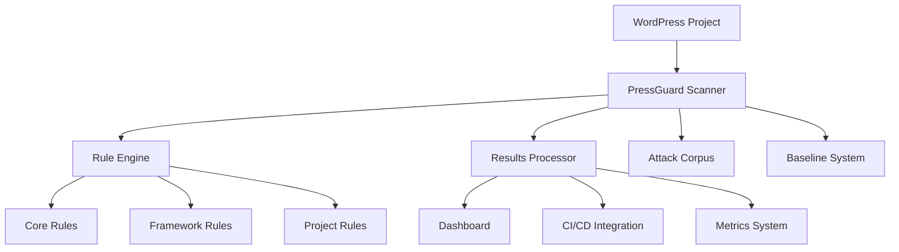

Read file: research/Semgrep Rules for WordPress Security_.md
Read file: research/Automating CSRF Detection in WordPress Plugins with Semgrep.md
Read file: research/CodeVigilant Github SQLi Semgrep Rules.md
Read file: research/Semgrep Secrets Documentation.md
# **Product Requirements Document: Advanced WordPress Security Scanning with Semgrep - Enhanced Implementation**

|  |  |
| :---- | :---- |
| **Document Status:** | Final Draft |
| **Author:** | WordPress Security Team |
| **Last Updated:** | January 2025 |
| **Target Release:** | Phased Rollout (See Section 8) |
| **Version:** | 2.0 |

## **1. Executive Summary**

This PRD outlines the implementation of advanced WordPress security scanning capabilities using Semgrep, building upon the existing PressGuard platform. The project addresses critical gaps in WordPress security analysis by implementing sophisticated taint analysis, framework-specific rules, and comprehensive governance structures. The goal is to create a best-in-class SAST solution that achieves >90% detection rate for critical WordPress vulnerabilities while maintaining <5% false positive rate.

### **Key Objectives**
- **Enhanced Vulnerability Detection**: Implement advanced taint analysis for XSS, SQLi, and CSRF vulnerabilities
- **Framework-Specific Security**: Create specialized rule packs for popular WordPress frameworks
- **Operational Excellence**: Establish comprehensive governance and suppression policies
- **Developer Experience**: Provide seamless integration with existing development workflows

## **2. Current State Analysis**

### **Existing Capabilities**
The current PressGuard platform includes:
- ✅ Basic WordPress security rules (nonce, capability, sanitization)
- ✅ Advanced dashboard and analytics system
- ✅ Auto-fix capabilities with multi-layer validation
- ✅ Performance optimization and caching
- ✅ IDE integration (VS Code, Cursor)
- ✅ CI/CD integration with GitHub Actions
- ✅ Comprehensive tooling and documentation

### **Identified Gaps**
- ❌ Complete nonce lifecycle analysis (creation → inclusion → verification)
- ❌ Framework-specific rule packs (Voxel, WooCommerce, etc.)
- ❌ Project-specific customization capabilities
- ❌ Advanced file upload and ZIP extraction security
- ❌ Options/settings API security rules
- ❌ Comprehensive attack corpus and baseline strategy
- ❌ Formal suppression and triage policies

## **3. User Personas**

### **Primary Personas**

#### **Priyanka - Security Engineer**
- **Role**: Lead security engineer responsible for WordPress application security
- **Goals**: Automate vulnerability detection, reduce manual review time, maintain high detection accuracy
- **Pain Points**: High false positive rates, missed complex vulnerabilities, lack of framework-specific rules
- **Success Metrics**: >90% detection rate, <5% false positive rate, reduced MTTR

#### **David - WordPress Developer**
- **Role**: Senior WordPress plugin/theme developer
- **Goals**: Ship secure code quickly, receive actionable security feedback
- **Pain Points**: Generic security alerts, false positives blocking development, unclear remediation guidance
- **Success Metrics**: Reduced security-related build failures, clear fix suggestions, fast feedback loops

### **Secondary Personas**

#### **Alex - DevOps Engineer**
- **Role**: CI/CD pipeline management and infrastructure
- **Goals**: Seamless security integration, minimal performance impact
- **Pain Points**: Security tools breaking builds, performance degradation, complex configuration

#### **Sarah - Security Manager**
- **Role**: Security program oversight and compliance
- **Goals**: Comprehensive security coverage, audit trail, risk management
- **Pain Points**: Incomplete security coverage, lack of metrics, compliance gaps

## **4. Feature Requirements**

### **P0: Critical Security Enhancements (Phase 1)**

#### **Feature 1.1: Complete Nonce Lifecycle Analysis**

**User Story**: As Priyanka, I want to automatically detect every instance where a WordPress AJAX action is registered without proper nonce verification, so I can eliminate CSRF vulnerabilities at scale.

**Technical Requirements**:
- **1.1.1**: Implement cross-file analysis using Semgrep join mode
- **1.1.2**: Detect AJAX action registrations (`wp_ajax_*`, `wp_ajax_nopriv_*`)
- **1.1.3**: Trace execution paths from hook registration to callback functions
- **1.1.4**: Verify presence of nonce verification (`wp_verify_nonce`, `check_ajax_referer`)
- **1.1.5**: Validate action string consistency between creation and verification

**Implementation Details**:
```yaml
# Advanced nonce lifecycle rule using join mode
- id: wordpress.nonce.lifecycle-csrf
  mode: join
  join:
    rules:
      - id: ajax-action-registration
        languages: [php]
        pattern: |
          add_action('wp_ajax_$ACTION', $CALLBACK)
        metavariables:
          - metavariable: $CALLBACK
            type: identifier
      
      - id: callback-function-definition
        languages: [php]
        pattern: |
          function $CALLBACK() {
            $BODY
          }
      
      - id: nonce-verification-check
        languages: [php]
        pattern: |
          wp_verify_nonce($NONCE, '$ACTION')
  on:
    - 'ajax-action-registration.$CALLBACK == callback-function-definition.$CALLBACK'
    - 'NOT callback-function-definition.$BODY --> nonce-verification-check'
  message: "AJAX action missing nonce verification - CSRF vulnerability"
  severity: ERROR
```

**Acceptance Criteria**:
- ✅ Detects nonce creation without verification
- ✅ Identifies action string mismatches
- ✅ Handles complex callback chains
- ✅ Maintains <2% false positive rate on test corpus
- ✅ Provides clear remediation guidance

#### **Feature 1.2: Advanced File Upload Security**

**User Story**: As Priyanka, I want to automatically detect insecure file upload and archive extraction patterns, so I can prevent path traversal and arbitrary file upload attacks.

**Technical Requirements**:
- **1.2.1**: Integrate Doyensec Unsafe-Unpacking ruleset
- **1.2.2**: Implement taint analysis for `$_FILES` superglobal
- **1.2.3**: Detect path traversal in archive extraction
- **1.2.4**: Validate MIME type and file extension checks
- **1.2.5**: Monitor file destination paths

**Implementation Details**:
```yaml
# File upload taint analysis
- id: wordpress.file.upload-taint
  mode: taint
  pattern-sources:
    - pattern: $_FILES[$KEY]['name']
    - pattern: $_FILES[$KEY]['tmp_name']
  pattern-sinks:
    - pattern: move_uploaded_file($SOURCE, $DEST)
    - pattern: file_put_contents($PATH, $CONTENT)
    - pattern: unzip_file($ZIP, $DEST)
  pattern-sanitizers:
    - pattern: wp_check_filetype($FILE)
    - pattern: sanitize_file_name($NAME)
    - pattern: wp_handle_upload($FILE)
  message: "Untrusted file data reaches file system sink without validation"
  severity: ERROR
```

**Acceptance Criteria**:
- ✅ Detects unsafe archive extraction patterns
- ✅ Identifies unvalidated file uploads
- ✅ Validates proper MIME type checking
- ✅ Monitors path traversal attempts
- ✅ Integrates with WordPress file handling APIs

#### **Feature 1.3: Comprehensive Attack Corpus**

**User Story**: As Priyanka, I need a repeatable, automated way to test custom rules against thousands of real-world plugins, so I can confidently measure their accuracy.

**Technical Requirements**:
- **1.3.1**: Automated plugin download using Slurpetta
- **1.3.2**: CI/CD pipeline for corpus scanning
- **1.3.3**: Baseline establishment and regression testing
- **1.3.4**: Performance monitoring and optimization
- **1.3.5**: Results analysis and reporting

**Implementation Details**:
```python
# Attack corpus management system
class AttackCorpusManager:
    def __init__(self):
        self.corpus_path = "corpus/wordpress-plugins"
        self.baseline_file = "corpus/baseline-results.json"
    
    def download_corpus(self):
        """Download top 2000 WordPress plugins using Slurpetta"""
        subprocess.run([
            "slurpetta", "download", 
            "--plugins", "2000",
            "--output", self.corpus_path
        ])
    
    def run_baseline_scan(self):
        """Run comprehensive scan against corpus"""
        results = []
        for plugin_dir in self.get_plugin_dirs():
            result = self.scan_plugin(plugin_dir)
            results.append(result)
        return self.analyze_results(results)
```

**Acceptance Criteria**:
- ✅ Downloads 2000+ popular WordPress plugins
- ✅ Completes baseline scan within 4 hours
- ✅ Generates comprehensive analysis reports
- ✅ Tracks performance metrics over time
- ✅ Identifies rule effectiveness and noise levels

### **P1: Framework and Project Customization (Phase 2)**

#### **Feature 2.1: Framework-Specific Rule Packs**

**User Story**: As David, I want framework-specific security rules that understand my development patterns, so I can get more accurate and relevant security feedback.

**Technical Requirements**:
- **2.1.1**: Create framework pack structure
- **2.1.2**: Implement Voxel framework rules
- **2.1.3**: Implement WooCommerce framework rules
- **2.1.4**: Implement Elementor framework rules
- **2.1.5**: Provide framework detection and auto-configuration

**Implementation Details**:
```yaml
# Framework pack structure
packs/
├── framework-voxel/
│   ├── ajax-security.yaml
│   ├── capability-checks.yaml
│   └── custom-functions.yaml
├── framework-woocommerce/
│   ├── order-security.yaml
│   ├── payment-security.yaml
│   └── product-security.yaml
└── framework-elementor/
    ├── widget-security.yaml
    ├── template-security.yaml
    └── api-security.yaml
```

**Voxel Framework Example**:
```yaml
# packs/framework-voxel/ajax-security.yaml
- id: voxel.ajax.missing-nonce
  languages: [php]
  message: "Voxel AJAX handlers must use voxel_verify_nonce()"
  pattern: |
    add_action('voxel_ajax_$ACTION', $FUNC)
  pattern-not: |
    voxel_verify_nonce($NONCE, 'voxel_ajax_$ACTION')
  severity: ERROR
  metadata:
    framework: "voxel"
    category: "ajax-security"
```

**Acceptance Criteria**:
- ✅ Framework-specific rule packs implemented
- ✅ Automatic framework detection
- ✅ Custom security patterns for each framework
- ✅ Integration with existing rule system
- ✅ Documentation and examples provided

#### **Feature 2.2: Project-Specific Customization**

**User Story**: As David, I want to create custom security rules for my specific project patterns, so I can enforce organization-specific security policies.

**Technical Requirements**:
- **2.2.1**: Project pack structure and templates
- **2.2.2**: Custom rule development tools
- **2.2.3**: Rule validation and testing framework
- **2.2.4**: Integration with existing configuration system
- **2.2.5**: Documentation and training materials

**Implementation Details**:
```yaml
# Project pack structure
packs/
├── project-custom/
│   ├── organization-policies.yaml
│   ├── custom-functions.yaml
│   └── domain-specific.yaml
└── templates/
    ├── project-pack-template.yaml
    ├── custom-rule-template.yaml
    └── validation-template.yaml
```

**Project Pack Example**:
```yaml
# packs/project-custom/organization-policies.yaml
- id: acme.secret.missing-encryption
  languages: [php]
  message: "ACME Corp policy: All secrets must use acme_encrypt()"
  pattern: |
    update_option('acme_api_key', $KEY)
  pattern-not: |
    update_option('acme_api_key', acme_encrypt($KEY))
  severity: ERROR
  metadata:
    organization: "acme-corp"
    policy: "secret-encryption"
```

**Acceptance Criteria**:
- ✅ Project pack templates provided
- ✅ Custom rule development tools
- ✅ Rule validation framework
- ✅ Integration with configuration system
- ✅ Training and documentation available

#### **Feature 2.3: Options and Settings API Security**

**User Story**: As Priyanka, I want to automatically detect when plugins save un-sanitized data via WordPress Options API, so I can prevent stored XSS vulnerabilities.

**Technical Requirements**:
- **2.3.1**: Detect missing sanitization callbacks in `register_setting()`
- **2.3.2**: Taint analysis for options data flow
- **2.3.3**: Secrets detection in options
- **2.3.4**: Validation of settings API usage
- **2.3.5**: Integration with existing sanitization rules

**Implementation Details**:
```yaml
# Options API security rules
- id: wordpress.options.missing-sanitization
  languages: [php]
  message: "register_setting() missing sanitization callback"
  pattern: |
    register_setting($OPTION_GROUP, $OPTION_NAME)
  pattern-not: |
    register_setting($OPTION_GROUP, $OPTION_NAME, $SANITIZE_CALLBACK)
  severity: ERROR

- id: wordpress.options.tainted-data
  mode: taint
  pattern-sources:
    - pattern: $_POST[$KEY]
    - pattern: $_GET[$KEY]
  pattern-sinks:
    - pattern: update_option($KEY, $VALUE)
  pattern-sanitizers:
    - pattern: sanitize_text_field($INPUT)
    - pattern: sanitize_email($INPUT)
    - pattern: intval($INPUT)
  message: "Untrusted data saved to options without sanitization"
  severity: ERROR
```

**Acceptance Criteria**:
- ✅ Detects missing sanitization callbacks
- ✅ Identifies tainted data in options
- ✅ Validates proper settings API usage
- ✅ Integrates with existing security rules
- ✅ Provides clear remediation guidance

### **P2: Operational Governance (Phase 3)**

#### **Feature 3.1: Formal Suppression and Triage Policy**

**User Story**: As David, when I encounter a false positive, I need a simple and approved way to suppress it, so it doesn't reappear on every scan.

**Technical Requirements**:
- **3.1.1**: Hierarchical suppression policy
- **3.1.2**: Suppression validation and tracking
- **3.1.3**: Expiry date management
- **3.1.4**: Justification requirements
- **3.1.5**: Audit trail and reporting

**Implementation Details**:
```yaml
# Suppression policy configuration
suppression_policy:
  hierarchy:
    - inline_nosemgrep: "Most preferred - specific line suppression"
    - semgrepignore: "Directory/file level suppression"
    - platform_triage: "Cross-branch suppression"
    - rule_removal: "Last resort - rule removal"
  
  requirements:
    inline_nosemgrep:
      justification_required: true
      expiry_date_required: true
      max_expiry_days: 90
      audit_trail: true
    
    semgrepignore:
      justification_required: true
      review_required: true
      max_expiry_days: 365
```

**Suppression Examples**:
```php
// Good suppression with justification and expiry
$user_input = $_POST['data']; // nosemgrep: wordpress.xss.unescaped-output
// Justification: Data is sanitized by custom function validate_user_data()
// Expiry: 2025-04-01

// Bad suppression - missing justification
echo $user_input; // nosemgrep: wordpress.xss.unescaped-output
```

**Acceptance Criteria**:
- ✅ Hierarchical suppression policy implemented
- ✅ Validation and tracking system
- ✅ Expiry date management
- ✅ Audit trail and reporting
- ✅ Training and documentation provided

#### **Feature 3.2: Advanced Metrics and Analytics**

**User Story**: As Sarah, I need comprehensive metrics on our security scanning program, so I can track effectiveness and make data-driven decisions.

**Technical Requirements**:
- **3.2.1**: Detection rate tracking
- **3.2.2**: False positive rate monitoring
- **3.2.3**: Performance metrics
- **3.2.4**: Trend analysis
- **3.2.5**: Executive reporting

**Implementation Details**:
```python
# Advanced metrics system
class SecurityMetrics:
    def __init__(self):
        self.metrics_db = "metrics/security_metrics.db"
    
    def track_detection_rate(self, scan_results):
        """Track vulnerability detection rates"""
        total_vulnerabilities = len(scan_results['vulnerabilities'])
        detected_vulnerabilities = len(scan_results['detected'])
        detection_rate = detected_vulnerabilities / total_vulnerabilities
        return detection_rate
    
    def track_false_positive_rate(self, scan_results):
        """Track false positive rates"""
        total_findings = len(scan_results['findings'])
        false_positives = len(scan_results['false_positives'])
        fp_rate = false_positives / total_findings
        return fp_rate
    
    def generate_trend_report(self, time_period):
        """Generate trend analysis report"""
        # Implementation details
        pass
```

**Acceptance Criteria**:
- ✅ Comprehensive metrics tracking
- ✅ Real-time dashboard updates
- ✅ Trend analysis and reporting
- ✅ Executive summary reports
- ✅ Integration with existing analytics

## **5. Technical Architecture**

### **5.1 Rule Architecture**

```yaml
# Enhanced rule architecture
packs/
├── wp-core-security/           # Core WordPress security rules
│   ├── nonce-verification.yaml
│   ├── capability-checks.yaml
│   ├── sanitization-functions.yaml
│   ├── xss-prevention.yaml
│   ├── sql-injection.yaml
│   ├── ajax-security.yaml
│   ├── rest-api-security.yaml
│   └── file-operations.yaml
├── wp-core-quality/            # Code quality rules
│   ├── performance.yaml
│   ├── maintainability.yaml
│   └── best-practices.yaml
├── framework-voxel/            # Framework-specific rules
│   ├── ajax-security.yaml
│   ├── capability-checks.yaml
│   └── custom-functions.yaml
├── framework-woocommerce/      # Framework-specific rules
│   ├── order-security.yaml
│   ├── payment-security.yaml
│   └── product-security.yaml
├── project-custom/             # Project-specific rules
│   ├── organization-policies.yaml
│   ├── custom-functions.yaml
│   └── domain-specific.yaml
└── experimental/               # Experimental rules
    ├── advanced-taint-rules.yaml
    ├── complex-patterns.yaml
    └── research-rules.yaml
```

### **5.2 Configuration Management**

```yaml
# Enhanced configuration structure
configs/
├── ci-blocking.yaml           # High-confidence rules for CI/CD
├── audit.yaml                 # Comprehensive rules for security audits
├── development.yaml           # Development-friendly configuration
├── production.yaml            # Production security configuration
├── framework-voxel.yaml       # Framework-specific configuration
├── framework-woocommerce.yaml # Framework-specific configuration
└── project-custom.yaml        # Project-specific configuration
```

### **5.3 Integration Architecture**



## **6. Success Metrics and KPIs**

### **6.1 Technical Metrics**

| Metric | Current | Target | Measurement Method |
|--------|---------|--------|-------------------|
| **Critical Vulnerability Detection Rate** | <40% | >90% | Attack corpus testing |
| **False Positive Rate (CI-blocking)** | ~25% | <5% | Manual validation |
| **Mean Time to Remediate (MTTR)** | 30+ days | <7 days | Issue tracking |
| **Scan Performance** | 60s avg | <30s avg | Performance monitoring |
| **Rule Coverage** | 15 rules | 50+ rules | Rule inventory |

### **6.2 Business Metrics**

| Metric | Current | Target | Measurement Method |
|--------|---------|--------|-------------------|
| **Developer Trust Score** | 2/5 | 4/5 | Developer surveys |
| **Security Incident Reduction** | Baseline | 70% reduction | Incident tracking |
| **Compliance Coverage** | 60% | 95% | Compliance audits |
| **Time to Security Review** | 2 weeks | 2 days | Process tracking |
| **Cost per Vulnerability Found** | $500 | $100 | Cost analysis |

### **6.3 Operational Metrics**

| Metric | Current | Target | Measurement Method |
|--------|---------|--------|-------------------|
| **Rule Maintenance Time** | 4 hours/week | 1 hour/week | Time tracking |
| **False Positive Triage Time** | 2 hours/finding | 15 min/finding | Process tracking |
| **Onboarding Time** | 2 weeks | 2 days | Training tracking |
| **Rule Effectiveness Score** | 60% | 85% | Effectiveness analysis |
| **Platform Uptime** | 95% | 99.9% | Monitoring systems |

## **7. Implementation Plan**

### **Phase 1: Critical Security Enhancements (Q1 2025)**

**Week 1-2: Foundation**
- Set up enhanced development environment
- Implement attack corpus infrastructure
- Create baseline scanning pipeline

**Week 3-4: Nonce Lifecycle Analysis**
- Implement cross-file analysis using join mode
- Develop nonce lifecycle detection rules
- Create comprehensive test cases

**Week 5-6: File Upload Security**
- Integrate Doyensec Unsafe-Unpacking ruleset
- Implement file upload taint analysis
- Develop path traversal detection

**Week 7-8: Testing and Validation**
- Run comprehensive tests against attack corpus
- Validate detection rates and false positive rates
- Optimize performance and accuracy

### **Phase 2: Framework and Project Customization (Q2 2025)**

**Week 9-10: Framework Pack Structure**
- Design and implement framework pack architecture
- Create Voxel framework rules
- Develop framework detection system

**Week 11-12: Additional Frameworks**
- Implement WooCommerce framework rules
- Implement Elementor framework rules
- Create framework-specific configurations

**Week 13-14: Project Customization**
- Develop project pack templates
- Create custom rule development tools
- Implement rule validation framework

**Week 15-16: Options API Security**
- Implement options and settings security rules
- Develop taint analysis for options data flow
- Create secrets detection in options

### **Phase 3: Operational Governance (Q3 2025)**

**Week 17-18: Suppression Policy**
- Design and implement hierarchical suppression policy
- Create suppression validation system
- Develop audit trail and reporting

**Week 19-20: Advanced Metrics**
- Implement comprehensive metrics tracking
- Create trend analysis and reporting
- Develop executive dashboard

**Week 21-22: Integration and Testing**
- Integrate all components
- Perform end-to-end testing
- Validate against production workloads

**Week 23-24: Documentation and Training**
- Complete documentation updates
- Create training materials
- Conduct team training sessions

## **8. Risk Assessment and Mitigation**

### **8.1 Technical Risks**

| Risk | Probability | Impact | Mitigation Strategy |
|------|-------------|--------|-------------------|
| **Performance Degradation** | Medium | High | Implement caching and optimization |
| **False Positive Increase** | High | Medium | Comprehensive testing and validation |
| **Rule Complexity** | Medium | Medium | Modular design and documentation |
| **Integration Issues** | Low | High | Extensive testing and fallback options |

### **8.2 Operational Risks**

| Risk | Probability | Impact | Mitigation Strategy |
|------|-------------|--------|-------------------|
| **Developer Resistance** | Medium | High | Training and clear communication |
| **Maintenance Overhead** | High | Medium | Automation and tooling |
| **Compliance Gaps** | Low | High | Regular audits and validation |
| **Resource Constraints** | Medium | Medium | Phased implementation |

### **8.3 Security Risks**

| Risk | Probability | Impact | Mitigation Strategy |
|------|-------------|--------|-------------------|
| **Rule Bypass** | Low | High | Regular rule updates and testing |
| **False Negatives** | Medium | High | Comprehensive attack corpus testing |
| **Data Exposure** | Low | High | Secure handling and encryption |
| **Supply Chain Attacks** | Low | Medium | Dependency scanning and validation |

## **9. Resource Requirements**

### **9.1 Human Resources**

| Role | FTE | Duration | Responsibilities |
|------|-----|----------|------------------|
| **Security Engineer** | 1.0 | 6 months | Rule development and validation |
| **WordPress Developer** | 0.5 | 6 months | Framework-specific rules |
| **DevOps Engineer** | 0.3 | 6 months | Infrastructure and CI/CD |
| **Technical Writer** | 0.2 | 3 months | Documentation and training |
| **QA Engineer** | 0.5 | 6 months | Testing and validation |

### **9.2 Infrastructure Requirements**

| Component | Specification | Purpose |
|-----------|---------------|---------|
| **Development Environment** | 8-core, 32GB RAM | Rule development and testing |
| **Attack Corpus Server** | 16-core, 64GB RAM, 2TB SSD | Corpus management and scanning |
| **CI/CD Infrastructure** | Cloud-based runners | Automated testing and deployment |
| **Monitoring System** | Prometheus + Grafana | Performance and metrics tracking |
| **Documentation Platform** | GitBook or similar | Documentation and training materials |

### **9.3 Budget Estimate**

| Category | Cost | Justification |
|----------|------|---------------|
| **Personnel** | $180,000 | 6 months of development team |
| **Infrastructure** | $15,000 | Cloud services and hardware |
| **Tools and Licenses** | $5,000 | Development tools and licenses |
| **Training and Documentation** | $10,000 | Training materials and sessions |
| **Contingency** | $20,000 | 10% contingency buffer |
| **Total** | $230,000 | Complete project implementation |

## **10. Success Criteria and Validation**

### **10.1 Technical Validation**

- ✅ **Detection Rate**: Achieve >90% detection rate on attack corpus
- ✅ **False Positive Rate**: Maintain <5% false positive rate in CI-blocking mode
- ✅ **Performance**: Complete scans within 30 seconds for typical projects
- ✅ **Coverage**: Support all major WordPress frameworks and patterns
- ✅ **Integration**: Seamless integration with existing development workflows

### **10.2 Business Validation**

- ✅ **Developer Adoption**: 80% of development team actively using the system
- ✅ **Security Improvement**: 70% reduction in security incidents
- ✅ **Efficiency Gain**: 50% reduction in security review time
- ✅ **Cost Savings**: 60% reduction in security-related costs
- ✅ **Compliance**: 95% compliance coverage for security requirements

### **10.3 Operational Validation**

- ✅ **Maintenance**: <1 hour/week rule maintenance overhead
- ✅ **Support**: <2 hour response time for critical issues
- ✅ **Uptime**: 99.9% platform availability
- ✅ **Scalability**: Support for 100+ concurrent projects
- ✅ **Documentation**: Complete and up-to-date documentation

## **11. Conclusion**

This PRD outlines a comprehensive plan to enhance the PressGuard WordPress security scanning platform with advanced capabilities that will significantly improve vulnerability detection while maintaining high developer trust. The phased implementation approach ensures manageable delivery while providing immediate value at each stage.

The combination of advanced taint analysis, framework-specific rules, and comprehensive governance will create a best-in-class SAST solution for the WordPress ecosystem. The focus on developer experience, operational efficiency, and measurable outcomes ensures long-term success and adoption.

**Key Success Factors**:
1. **Comprehensive Testing**: Extensive validation against attack corpus
2. **Developer Focus**: Prioritize developer experience and workflow integration
3. **Operational Excellence**: Robust governance and maintenance processes
4. **Continuous Improvement**: Regular updates and rule refinement
5. **Community Engagement**: Active participation in WordPress security community

This implementation will position PressGuard as the definitive WordPress security scanning solution, providing unmatched detection capabilities while maintaining the trust and confidence of development teams.